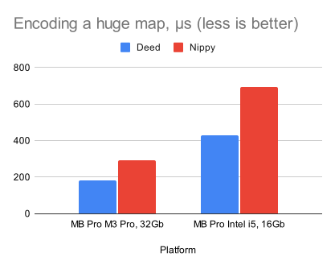
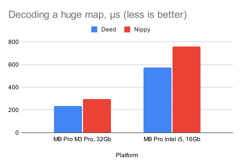

# Deed

A fast, zero-deps binary encoding and decoding library for Clojure.

## Table of Contents

<!-- toc -->

- [About](#about)
- [Motivation](#motivation)
- [Installation & Requirements](#installation--requirements)
- [Quick Demo](#quick-demo)
- [API](#api)
  * [Simple Encode and Decode](#simple-encode-and-decode)
  * [Encoding to Memory](#encoding-to-memory)
  * [Sequential Encoding and Decoding](#sequential-encoding-and-decoding)
  * [Low-Level API](#low-level-api)
  * [API Options](#api-options)
- [GZipped Streams](#gzipped-streams)
- [Appending to a File](#appending-to-a-file)
- [Handle Unsupported Types](#handle-unsupported-types)
- [Supported Types](#supported-types)
- [Extending Custom Types](#extending-custom-types)
  * [Encode](#encode)
  * [Decode](#decode)
  * [Macros](#macros)
- [Handling Defrecords](#handling-defrecords)
- [Contrib](#contrib)
  * [Base64](#base64)
  * [VectorZ](#vectorz)
- [Binary Format](#binary-format)
- [Benchmarks](#benchmarks)

<!-- tocstop -->

## About

[vectorz]: https://github.com/mikera/vectorz

Deed is a library to dump any value into a byte array and read it back. It
supports plenty of types out from the box: Java primitives, most of the Clojure
types, Java collections, date and time, and so on. It supports even such tricky
types as atoms, refs, and input streams. The full list of supported types is
shown in the ["Supported Types"](#supported-types) section below.

Deed can be extended with custom types with ease. There is a contrib package
that extends encoding and decoding logic for vectors from the the well-known
[mikera/vectorz][vectorz] library.

Deed is written in pure Java and thus is pretty fast (see the
["Benchmarks"](#benchmarks) section). It's about 30-50% faster than Nippy.

It doesn't rely on the built-in Java `Serializable` interface for security
reasons. Every type is processed manually.

Deep provides convenient API for reading the frozen data lazily one by one.

## Motivation

Obviously you would ask why doing this if we already have Nippy? This is what I
had in mind while working on Deed:

1. The library must be **absolutely free** from dependencies. This is true for
   the `deed-core` package: it's written in pure Java with no dependencies at
   all. By adding it into a project, you won't blow up you uberjar, nor you will
   have troubles with building a native image with GraalVM.

2. Any part of Deed that requires 3rd-party stuff must be a sub-library. So you
   have precise control of what you use and what you don't

3. Unlike Nippy, Deed never falls back to native Java serialization. There is no
   such an option. Thus, your application cannot be attacked by someone how has
   forged a binary dump.

4. Deed is simple: it blindly works with input- and output byte streams having
   no idea what's behind them. It doesn't take compression nor encryption into
   account -- yet there are utilities for streams.

5. The library provides API which personally I consider more convenient than
   Nippi's. Namely, Deed can lazily iterate on a series of encoded data instead
   of reading the whole dump at once.

6. Finally, why not using popular and cross-platform formats like JSON, Message
   Pack, or YAML? Well, because of poor types support. JSON has only primitive
   types and collections, and nothing else. Extending it with custom types is
   always a pain. At the same time, I want my decoded data be as close to the
   origin data as possible, say, `LocalDateTime` be an instance of
   `LocalDateTime` but not a string or `java.util.Date`. Sometimes, preserving
   metadata is crucial. To haldle all of these cases, there now a way other than
   making your own library.

## Installation & Requirements

Deed requires Java version at least 16 to run. Tested with Clojure 1.9.0.

**The core module** with basic encode and decode capabilities:

~~~clojure
;; lein
[com.github.igrishaev/deed-core "0.1.0"]

;; deps
com.github.igrishaev/deed-core {:mvn/version "0.1.0"}
~~~

**Base64 module** do encode and decode from/into base64 on the fly:

~~~clojure
;; lein
[com.github.igrishaev/deed-base64 "0.1.0"]

;; deps
com.github.igrishaev/deed-base64 {:mvn/version "0.1.0"}
~~~

**Vectorz module** extends Deed with a number of `Vector*` classes from the
[mikera/vectorz][vectorz] library:

~~~clojure
;; lein
[com.github.igrishaev/deed-vectorz "0.1.0"]

;; deps
com.github.igrishaev/deed-vectorz {:mvn/version "0.1.0"}
~~~

## Quick Demo

This is a very brief example of how to dump the data into a file. Prepare the
namespace with imports:

~~~clojure
(ns demo
  (:require
   [clojure.java.io :as io]
   [deed.core :as deed]))
~~~

Declare the file and the data:

~~~clojure
(def file
  (io/file "dump.deed"))

(def data
  {:number 1
   :string "hello"
   :bool true
   :nil nil
   :symbol 'hello/test
   :simple-kw :test
   :complex-kw :foo/bar
   :vector [1 2 :test nil 42 "hello"]
   :map {:test {:bar {'dunno {"lol" [:kek]}}}}
   :set #{:a :b :c}
   :atom (atom {:abc 42})})
~~~

Pass them into the `encode-to` function as follows:

~~~clojure
(deed/encode-to data file)
~~~

And this is it! If you examine the file with any kind of a hex editor, you'll
see a binary payload:

~~~clojure
xxd /path/to/dump.deed

00000000: 0001 0001 0000 0000 0000 0000 0000 0000  ................
00000010: 0000 0000 0000 0000 0000 0000 0000 0000  ................
00000020: 0000 003b 0000 000b 004a 0000 0006 6e75  ...;.....J....nu
00000030: 6d62 6572 000e 004a 0000 0006 7379 6d62  mber...J....symb
00000040: 6f6c 004b 0000 000a 6865 6c6c 6f2f 7465  ol.K....hello/te
00000050: 7374 004a 0000 000a 636f 6d70 6c65 782d  st.J....complex-
00000060: 6b77 004a 0000 0007 666f 6f2f 6261 7200  kw.J....foo/bar.
00000070: 4a00 0000 0673 7472 696e 6700 2b00 0000  J....string.+...
00000080: 0568 656c 6c6f 004a 0000 0006 7665 6374  .hello.J....vect
00000090: 6f72 002e 0000 0006 000e 000c 0000 0000  or..............
000000a0: 0000 0002 004a 0000 0004 7465 7374 0000  .....J....test..
000000b0: 000c 0000 0000 0000 002a 002b 0000 0005  .........*.+....
000000c0: 6865 6c6c 6f00 4a00 0000 036e 696c 0000  hello.J....nil..
000000d0: 004a 0000 0004 626f 6f6c 0029 004a 0000  .J....bool.).J..
000000e0: 0003 7365 7400 3300 0000 0300 4a00 0000  ..set.3.....J...
000000f0: 0163 004a 0000 0001 6200 4a00 0000 0161  .c.J....b.J....a
00000100: 004a 0000 0009 7369 6d70 6c65 2d6b 7700  .J....simple-kw.
00000110: 4a00 0000 0474 6573 7400 4a00 0000 0461  J....test.J....a
00000120: 746f 6d00 3000 3b00 0000 0100 4a00 0000  tom.0.;.....J...
00000130: 0361 6263 000c 0000 0000 0000 002a 004a  .abc.........*.J
00000140: 0000 0003 6d61 7000 3b00 0000 0100 4a00  ....map.;.....J.
00000150: 0000 0474 6573 7400 3b00 0000 0100 4a00  ...test.;.....J.
00000160: 0000 0362 6172 003b 0000 0001 004b 0000  ...bar.;.....K..
00000170: 0005 6475 6e6e 6f00 3b00 0000 0100 2b00  ..dunno.;.....+.
00000180: 0000 036c 6f6c 002e 0000 0001 004a 0000  ...lol.......J..
00000190: 0003 6b65 6b                             ..kek
~~~

Now that you have a .deed file, read it back using the `decode-from` function:

~~~clojure
(def data-back
  (deed/decode-from file))
~~~

Print the `data-back` to ensure it keeps the origin types:

~~~clojure
{:number 1,
 :symbol hello/test,
 :complex-kw :foo/bar,
 :string "hello",
 :vector [1 2 :test nil 42 "hello"],
 :nil nil,
 :bool true,
 :set #{:c :b :a},
 :simple-kw :test,
 :atom #<Atom@75f6dd87: {:abc 42}>,
 :map {:test {:bar {dunno {"lol" [:kek]}}}}}
~~~

Compare them to ensure we didn't loose anything. Since atoms cannot be compared,
we `dissoc` them from both sides:

~~~clojure
(= (dissoc data :atom) (dissoc data-back :atom))
;; true
~~~

Deed supports plenty of built-in Clojure and Java types. The next section
describes which API it provides to manage the data.

## API

### Simple Encode and Decode

The `encode-to` function accepts two parameters: a value and an output. The
value is an instance of any [supported type](#supported-types) (a map, a vector,
etc).

The output is anything that can be coerced to the output stream using the
`io/output-stream` function. It could be a file, another output stream, a byte
array, or similar. If you pass a string, it's treated a file name which will be
created.

Examples:

~~~clojure
(deed/encode-to {:foo 123} "test.deed")

(deed/encode-to {:foo 123} (io/file "test2.deed"))

(deed/encode-to {:foo 123} (-> "test3.deed"
                               io/file
                               io/output-stream))
~~~

All the three invocations above dump the same map `{:foo 123}` into different
files.

To read the data back, invoke the `decode-from` function. It accepts anything
that can be coerced into an input stream using the `io/input-stream`
function. It might be a file, another stream, a byte array, or a name of a file.

~~~clojure
(deed/decode-from "test.deed")
;; {:foo 123}

(deed/decode-from (io/file "test2.deed"))
;; {:foo 123}

(deed/decode-from (-> "test3.deed"
                      io/file
                      io/input-stream))
;; {:foo 123}
~~~

### Encoding to Memory

The functions below rely on external IO resources. If you want to dump the data
into memory, use the `encode-to-bytes` function. It returns a byte array without
any IO interaction:

~~~clojure
(def buf
  (deed/encode-to-bytes {:test 123}))

(println (vec buf))

[0 1 0 1 0 0 ... 59 0 0 0 1 0 74 0 0 0 4 116 101 115 116 0 12 0 0 0 0 0 0 0 123]
~~~

There is no an opposite `decode-from-bytes` function because a byte array is
already a data source for the `decode-from` function. Just pass the result into
it:

~~~clojure
(deed/decode-from buf)
;; {:test 123}
~~~

### Sequential Encoding and Decoding

We often dump vast collections to explore them afterwards. Say, you're going to
write 10M of database rows into a file to find a broken row with a script.

The functions above encode and decode a single value. That's OK for primitive
types and maps but not good for vast collections. For example, if you encode a
vector of 10M items into a file and read it back, you'll get the same vector of
10M items back. Most likely you don't need all of these at once: you'd better to
iterate on them one by one.

This is the case that `encode-seq-to` and `decode-seq-from` functions cover. The
first function accepts a collection of items and writes them sequentially. It's
not a vector any longer but a series of items written one after another. The
`encode-seq-to` invocation returns the number of items written:

~~~clojure
(deed/encode-seq-to [1 2 3] "test.deed")
;; 3
~~~

Instead of a vector, there might be a lazy sequence, or anything that can be
iterated.

If you read the dump using `decode-from`, you'll get the first item only:

~~~clojure
(deed/decode-from "test.deed")
1
~~~

To read all of them, use `decode-seq-from`:

~~~clojure
(deed/decode-seq-from "test.deed")
[1 2 3]
~~~

What is the point to use sequential encoding? Because with a special API, you
can read them lazily one by one.

The `with-decoder` macro takes two parameters: the binding symbol and the
input. Internally, it creates a `Decoder` instance and binds it to the first
symbol. The `decode-seq` function returns a lazy sequence of items from a
decoder:

~~~clojure
(deed/with-decoder [d "test.deed"]
  (doseq [item (deed/decode-seq d)]
    (println item)))
;; 1
;; 2
;; 3
~~~

You must process items before you exit the `with-decoder` macro.

The form above might be rewritten using the `with-open` macro. Since the
`Decoder` object implements `AutoCloseable` interface, it handles the `.close`
method which in turn closes the underlying stream.

~~~clojure
(with-open [d (deed/decoder "test.deed")]
  (doseq [item (deed/decode-seq d)]
    (println item)))
~~~

In fact, you don't even need to pass the decoder object into `decode-seq`
because it implements the `Iterable` Java interface. Just iterate the decoder:

~~~clojure
(deed/with-decoder [d "test.deed"]
  (mapv inc d))
;; [2 3 3]

(deed/with-decoder [d "test.deed"]
  (doseq [item d]
    (println "item is" item)))
;; item is 1
;; item is 2
;; item is 3
~~~

The items are read lazily so you won't saturate memory.

### Low-Level API

Deed provides low-level API for conditional or imperative encoding. The `encode`
function writes a value into an instance of the `Encoder` class. You can use it
in a cycle with some condition:

~~~clojure
(deed/with-encoder [e "test.deed"]
  (doseq [x (range 1 32)]
    (when (even? x)
      (deed/encode e x))))
~~~

The `decode` function reads an object from the `Decoder` instance. When the end
of the stream is met, you'll get a special `EOF` object that you can check using
the `eof?` preficate:

~~~clojure
(deed/with-decoder [d "test.deed"]
  (loop [i 0]
    (let [item (deed/decode d)]
      (if (deed/eof? item)
        (println "EOF")
        (do
          (println "item" i item)
          (recur (inc i)))))))

;; item 0 2
;; item 1 4
;; item 2 6
;; item 3 8
;; item 4 10
;; item 5 12
;; item 6 14
;; item 7 16
;; item 8 18
;; item 9 20
;; item 10 22
;; item 11 24
;; item 12 26
;; item 13 28
;; item 14 30
;; EOF
~~~

The low-level might be useful when you need precise control on encoding and
decoding.

### API Options

Most of the functions accept an optional map of parameters. Here is a list of
options supported at the moment:

| Name                     | Default           | Meaning                                                                                                                   |
|--------------------------|-------------------|---------------------------------------------------------------------------------------------------------------------------|
| `:deref-timeout-ms`      | 5000              | The number of milliseconds to wait when derefing futures.                                                                 |
| `:object-chunk-size`     | 0xFF              | The number of object chunk when encoding uncountable collections (e.g. lazy seqs).                                        |
| `:byte-chunk-size`       | 0xFFFF            | The number of byte chunk when encoding input streams.                                                                     |
| `:uncountable-max-items` | Integer.MAX_VALUE | The max number of items to process when encoding uncountable collections (e.g. lazy seqs).                                |
| `:encode-unsupported?`   | true              | If true, dump every unsupported object into a string ([see below](#handle-unsupported-types)). Otherwise, throw an error. |
| `:io-temp-file?`         | false             | When deciding previously encoded input stream, write its payload into a temp file.                                        |
| `:save-meta?`            | true              | Preserve metadata for objects what have it.                                                                               |
| `:append?`               | false             | Write at the end of an existing dump ([see below](#appending-to-a-file)).                                                           |

That's unlikely you'll need to change any of these, yet in rare cases they might
help.

## GZipped Streams

Deed has a couple of functions that turn any input or output into
`GZIPInputStream` and `GZIPOutputStream` instances respectfully. It allows to
compress the data on the fly. Here is how you compress:

~~~clojure
(with-open [out (deed/gzip-output-stream "dump.deed.gz")]
  (deed/encode-to [1 2 3] out))
~~~

And decompress:

~~~clojure
(with-open [in (deed/gzip-input-stream "dump.deed.gz")]
  (deed/decode-from in))
;; [1 2 3]
~~~

Keep in mind that compression saves disk space but consumes CPU usage.

## Appending to a File

In rare cases, you'd like to append data to an existing file. This might be done
in two steps. First, you initiate the `FileOutputStream` object manually and
pass the `true` boolean flag meaning put the content at the end of a file, not
the beginning:

~~~clojure
(with-open [out (new FileOutputStream file true)]
  ...)
~~~

Second, when encoding the data into such an output, specify the `{:append?
true}` option. In this case, Deed won't emit a leading `deed.Header` object:

~~~clojure
(with-open [out (new FileOutputStream file true)]
  (deed/encode-to {:hello 123} out {:append? true}))
~~~

## Handle Unsupported Types

By default, when Deed doesn't know how to encode an object, it turns it into a
string using the standard `.toString` method. Than it makes a special
`Unsupported` object that tracks full class name and the text payload. Let's
present it with a custom `deftype` declaration:

~~~clojure
(deftype MyType [a b c])

(def mt (new MyType :hello "test" 42))

(deed/encode-to mt "test.deed")

(deed/decode-from "test.deed")
;; #<Unsupported@b918edf: {:content "demo.MyType@4376ae5c", :class "demo.MyType"}>
~~~

The `Unsupported` object can be checked with the `unsupported?` predicate:

~~~clojure
(def mt-back
  (deed/decode-from "test.deed"))

(deed/unsupported? mt-back)
;; true
~~~

To coerce it to Clojure, just `deref` it:

~~~clojure
@mt-back
{:content "demo.MyType@4376ae5c", :class "demo.MyType"}
~~~

Above, the `"demo.MyType@4376ae5c"` string doesn't say much. This is because the
default `.toString` implementation of `deftype` lacks fields. That's why it's
always worth overriding the `.toString` method for custom types:

~~~clojure
(deftype MyType [a b c]
  Object
  (toString [_]
    (format "<MyType: %s, %s, %s>" a b c)))

(def mt (new MyType :hello "test" 42))

(deed/encode-to mt "test.deed")

(def mt-back
  (deed/decode-from "test.deed"))

(str mt-back)
;; "Unsupported[className=demo.MyType, content=<MyType: :hello, test, 42>]"

@mt-back
;; {:content "<MyType: :hello, test, 42>", :class "demo.MyType"}
~~~

Now the content has fields, so at least you can observe them.

When the `:encode-unsupported?` boolean option is false, Deed throws an
exception by facing an unsupported object:

~~~clojure
(deed/encode-to mt "test.deed" {:encode-unsupported? false})

;; Execution error at deed.Err/error (Err.java:14).
;; Cannot encode object, type: demo.MyType, object: <MyType: :hello, test, 42>
~~~

## Supported Types

The table below renders types supported by Deed out from the box:

| OID    | TAG                  | Class                                  | Comment                                                                                                                                                                                            |
|--------|----------------------|----------------------------------------|----------------------------------------------------------------------------------------------------------------------------------------------------------------------------------------------------|
| 0x0000 | NULL                 | `null` (`nil`)                         |                                                                                                                                                                                                    |
| 0x0001 | HEADER               | `deed.Header`                          | A leading object with general info about encoding                                                                                                                                                  |
| 0x0002 | UNSUPPORTED          | `deed.Unsupported`                     | A wrapper for unsupported objects                                                                                                                                                                  |
| 0x0003 | META                 |                                        | Specifies an object with metadata                                                                                                                                                                  |
| 0x0004 | INT                  | `int`, `java.lang.Integer`             |                                                                                                                                                                                                    |
| 0x0005 | INT_ZERO             |                                        | A special OID for 0 int                                                                                                                                                                            |
| 0x0006 | INT_ONE              |                                        | A special OID for 1 int                                                                                                                                                                            |
| 0x0007 | INT_MINUS_ONE        |                                        | A special OID for -1 int                                                                                                                                                                           |
| 0x0008 | SHORT                | `short`, `java.lang.Short`             |                                                                                                                                                                                                    |
| 0x0009 | SHORT_ZERO           |                                        | A special OID for 0 short                                                                                                                                                                          |
| 0x000A | SHORT_ONE            |                                        | A special OID for 1 short                                                                                                                                                                          |
| 0x000B | SHORT_MINUS_ONE      |                                        | A special OID for -1 short                                                                                                                                                                         |
| 0x000C | LONG                 | `long`, `java.lang.Long`               |                                                                                                                                                                                                    |
| 0x000D | LONG_ZERO            |                                        |                                                                                                                                                                                                    |
| 0x000E | LONG_ONE             |                                        |                                                                                                                                                                                                    |
| 0x000F | LONG_MINUS_ONE       |                                        |                                                                                                                                                                                                    |
| 0x0010 | IO_INPUT_STREAM      | `java.io.InputStream`                  | When decoding, the bytes are put into a `ByteArrayInputStream`. It's also possible to put them into a temp file and obtain a `FileInputStream`                                                     |
| 0x0011 | IO_READER            | -                                      | Not implemented                                                                                                                                                                                    |
| 0x0012 | IO_FILE              | -                                      | Not implemented                                                                                                                                                                                    |
| 0x0013 | IO_BYTEBUFFER        | `java.nio.ByteBuffer`                  |                                                                                                                                                                                                    |
| 0x0014 | ARR_BYTE             | `byte[]`                               |                                                                                                                                                                                                    |
| 0x0015 | ARR_INT              | `int[]`                                |                                                                                                                                                                                                    |
| 0x0016 | ARR_SHORT            | `short[]`                              |                                                                                                                                                                                                    |
| 0x0017 | ARR_BOOL             | `boolean[]`                            |                                                                                                                                                                                                    |
| 0x0018 | ARR_FLOAT            | `float[]`                              |                                                                                                                                                                                                    |
| 0x0019 | ARR_DOUBLE           | `double[]`                             |                                                                                                                                                                                                    |
| 0x001A | ARR_OBJ              | `Object[]`                             |                                                                                                                                                                                                    |
| 0x001B | ARR_LONG             | `long[]`                               |                                                                                                                                                                                                    |
| 0x001C | ARR_CHAR             | `char[]`                               |                                                                                                                                                                                                    |
| 0x001D | REGEX                | `java.util.regex.Pattern`              |                                                                                                                                                                                                    |
| 0x001E | CLJ_SORTED_SET       | `clojure.lang.PersistentTreeSet`       | A sorted set usually created with `(sorted-set ...)`                                                                                                                                               |
| 0x001F | CLJ_SORTED_SET_EMPTY |                                        | A special OID for an empty sorted set                                                                                                                                                              |
| 0x0020 | CLJ_SORTED_MAP       | `clojure.lang.PersistentTreeMap`       | A sorted map usually created with `(sorted-map ...)`                                                                                                                                               |
| 0x0021 | CLJ_SORTED_MAP_EMPTY |                                        | An empty sorted map                                                                                                                                                                                |
| 0x0022 | URI                  | `java.net.URI`                         |                                                                                                                                                                                                    |
| 0x0023 | URL                  | `java.net.URL`                         |                                                                                                                                                                                                    |
| 0x0024 | EXCEPTION            | `java.lang.Exception`                  | Keeps message, class name, stack trace, cause (recursively encoded), and all the suppressed exceptions                                                                                             |
| 0x0025 | IO_EXCEPTION         |                                        |                                                                                                                                                                                                    |
| 0x0026 | THROWABLE            |                                        |                                                                                                                                                                                                    |
| 0x0027 | EX_INFO              |                                        |                                                                                                                                                                                                    |
| 0x0028 | EX_NPE               |                                        |                                                                                                                                                                                                    |
| 0x0029 | BOOL_TRUE            | `boolean`, `java.lang.Boolean`         | True value only                                                                                                                                                                                    |
| 0x002A | BOOL_FALSE           | `boolean`, `java.lang.Boolean`         | False value only                                                                                                                                                                                   |
| 0x002B | STRING               | `java.lang.String`                     | Stored as a number of bytes + bytes                                                                                                                                                                |
| 0x002C | STRING_EMPTY         |                                        | A special OID indicating an empty string                                                                                                                                                           |
| 0x002D | CHAR                 | `char`, `java.lang.Character`          |                                                                                                                                                                                                    |
| 0x002E | CLJ_VEC              | `clojure.lang.APersistentVector`       | A standard Clojure vector                                                                                                                                                                          |
| 0x002F | CLJ_VEC_EMPTY        |                                        | A special OID indicating an empty vector                                                                                                                                                           |
| 0x0030 | CLJ_ATOM             | `clojure.lang.Atom`                    | Gets deref-ed when encoding                                                                                                                                                                        |
| 0x0031 | CLJ_REF              | `clojure.lang.Ref`                     | Gets deref-ed when encoding                                                                                                                                                                        |
| 0x0032 | FUTURE               | `java.util.concurrent.Future`          | Deed `.get`s the value using timeout from options. When time is up, an exception is throw. When decoded, it's returned as an instance of `deed.FutureWrapper`: a fake object that mimics a future. |
| 0x0033 | CLJ_SET              | `clojure.lang.APersistentSet`          | A standard Clojure immutable set                                                                                                                                                                   |
| 0x0034 | CLJ_SET_EMPTY        |                                        | A special OID indicating an empty set                                                                                                                                                              |
| 0x0035 | CLJ_LAZY_SEQ         | `clojure.lang.LazySeq`                 | Encode a lazy sequence produced with `map`, `for`, etc. Stored as a collection of chunks like `<chunk-len><items...>`. When decoding, read until the chunk of zero length is met.                  |
| 0x0036 | CLJ_SEQ              | Type depends on the origin collection  | Becomes a vector when decoding                                                                                                                                                                     |
| 0x0037 | CLJ_LIST             | `clojure.lang.PersistentList`          |                                                                                                                                                                                                    |
| 0x0038 | CLJ_LIST_EMPTY       |                                        | A special OID indicating an empty list                                                                                                                                                             |
| 0x0039 | CLJ_QUEUE            | `clojure.lang.PersistentQueue`         |                                                                                                                                                                                                    |
| 0x003A | CLJ_QUEUE_EMPTY      |                                        | A special OID indicating an empty queue                                                                                                                                                            |
| 0x003B | CLJ_MAP              | `clojure.lang.APersistentMap`          |                                                                                                                                                                                                    |
| 0x003C | CLJ_MAP_EMPTY        | `clojure.lang.APersistentMap`          | An empty Clojure map                                                                                                                                                                               |
| 0x003D | CLJ_MAP_ENTRY        | `clojure.lang.MapEntry`                | A pair of key and value                                                                                                                                                                            |
| 0x003E | CLJ_RECORD           | `clojure.lang.IRecord`                 | An instance of `defrecord` object. When decoding, becomes an ordinary map. To preserve the origin type, use the `handle-record` macro (see below).                                                 |
| 0x003F | CLJ_TR_VEC           | `c.l.PersistentVector$TransientVector` | A transient Clojure vector.                                                                                                                                                                        |
| 0x0040 | JVM_MAP              | `java.util.Map`                        | A Java map, usually an instance of `HashMap`.                                                                                                                                                      |
| 0x0041 | JVM_MAP_ENTRY        | `java.util.Map$Entry`                  |                                                                                                                                                                                                    |
| 0x0042 | UUID                 | `java.util.UUID`                       |                                                                                                                                                                                                    |
| 0x0043 | JVM_LIST             | `java.util.List`                       | When decoding, becomes an instance of `ArrayList`.                                                                                                                                                 |
| 0x0044 | JVM_LIST_EMPTY       | `java.util.List`                       | A stub for an empty list.                                                                                                                                                                          |
| 0x0045 | JVM_VECTOR           | `java.util.Vector`                     |                                                                                                                                                                                                    |
| 0x0046 | JVM_VECTOR_EMPTY     |                                        | An empty Java vector.                                                                                                                                                                              |
| 0x0047 | JVM_ITERABLE         | `java.lang.Iterable`                   | Encoded as uncounted chunked sequence of objects                                                                                                                                                   |
| 0x0048 | JVM_ITERATOR         |                                        | When decoding, becomes an instance of `ArrayList`.                                                                                                                                                 |
| 0x0049 | JVM_STREAM           | `java.util.stream.Stream`              |                                                                                                                                                                                                    |
| 0x004A | CLJ_KEYWORD          | `clojure.lang.Keyword`                 |                                                                                                                                                                                                    |
| 0x004B | CLJ_SYMBOL           | `clojure.lang.Symbol`                  |                                                                                                                                                                                                    |
| 0x004C | UTIL_DATE            | `java.util.Date`                       |                                                                                                                                                                                                    |
| 0x004D | DT_LOCAL_DATE        | `java.time.LocalDate`                  |                                                                                                                                                                                                    |
| 0x004E | DT_LOCAL_TIME        | `java.time.LocalTime`                  |                                                                                                                                                                                                    |
| 0x004F | DT_LOCAL_DATETIME    | `java.time.LocalDateTime`              |                                                                                                                                                                                                    |
| 0x0050 | DT_OFFSET_DATETIME   | `java.time.OffsetDateTime`             |                                                                                                                                                                                                    |
| 0x0051 | DT_OFFSET_TIME       | `java.time.OffsetTime`                 |                                                                                                                                                                                                    |
| 0x0052 | DT_DURATION          | `java.time.Duration`                   |                                                                                                                                                                                                    |
| 0x0053 | DT_PERIOD            | `java.time.Period`                     |                                                                                                                                                                                                    |
| 0x0054 | DT_ZONED_DATETIME    | `java.time.ZonedDateTime`              |                                                                                                                                                                                                    |
| 0x0055 | DT_ZONE_ID           | `java.time.ZoneId`                     |                                                                                                                                                                                                    |
| 0x0056 | DT_INSTANT           | `java.time.Instant`                    |                                                                                                                                                                                                    |
| 0x0057 | SQL_TIMESTAMP        | `java.sql.Timestamp`                   |                                                                                                                                                                                                    |
| 0x0058 | SQL_TIME             | `java.sql.Time`                        |                                                                                                                                                                                                    |
| 0x0059 | SQL_DATE             | `java.sql.Date`                        |                                                                                                                                                                                                    |
| 0x005A | BYTE                 | `byte`, `java.lang.Byte`               |                                                                                                                                                                                                    |
| 0x005B | BYTE_ZERO            |                                        | A stub for byte 0                                                                                                                                                                                  |
| 0x005C | BYTE_ONE             |                                        | A stub for byte 1                                                                                                                                                                                  |
| 0x005D | BYTE_MINUS_ONE       |                                        | A stub for byte -1                                                                                                                                                                                 |
| 0x005E | FLOAT                | `float`, `java.lang.Float`             |                                                                                                                                                                                                    |
| 0x005F | FLOAT_ZERO           |                                        | A stub for float 0                                                                                                                                                                                 |
| 0x0060 | FLOAT_ONE            |                                        | A stub for float 1                                                                                                                                                                                 |
| 0x0061 | FLOAT_MINUS_ONE      |                                        | A stub for float -1                                                                                                                                                                                |
| 0x0062 | DOUBLE               | `double`, `java.lang.Double`           |                                                                                                                                                                                                    |
| 0x0063 | DOUBLE_ZERO          |                                        | A stub for double 0                                                                                                                                                                                |
| 0x0064 | DOUBLE_ONE           |                                        | A stub for double 1                                                                                                                                                                                |
| 0x0065 | DOUBLE_MINUS_ONE     |                                        | A stub for double -1                                                                                                                                                                               |
| 0x0066 | JVM_BIG_DEC          | `java.math.BigDecimal`                 |                                                                                                                                                                                                    |
| 0x0067 | JVM_BIG_INT          | `java.math.BigInteger`                 |                                                                                                                                                                                                    |
| 0x0068 | CLJ_BIG_INT          | `clojure.lang.BigInt`                  |                                                                                                                                                                                                    |
| 0x0069 | CLJ_RATIO            | `clojure.lang.Ratio`                   |                                                                                                                                                                                                    |
| 0x006A | VECTORZ_AVECTOR      | `mikera.vectorz.AVector`               | See the `deed-vectorz` package                                                                                                                                                                     |

## Extending Custom Types

### Encode

Although Deed handles plenty of types, you can easily have a type that is
unknown to it. Handling such a type is a matter of two things: extending both
encoding and decoding logic.

Imagine you have a custom `deftype` with three fields:

~~~clojure
(deftype SomeType [x y z]
  ...)
~~~

[oids]: deed-core/src/java/deed/OID.java

Here is how you extend the encoding logic. First, declare a custom OID number
for it. The number must be `short` (two bytes) meaning the range from -32768
to 32767. When declaring such an OID, please ensure it doens't overlap with
[pre-existing OIDs][oids].

~~~clojure
(def SomeTypeOID 4321)
~~~

Then extend the `IEncode` protocol with that type:

~~~clojure
(extend-protocol deed/IEncode
  SomeType
  (-encode [this encoder]
    (deed/writeOID encoder SomeTypeOID) ;; !
    (deed/encode encoder (.-x this))
    (deed/encode encoder (.-y this))
    (deed/encode encoder (.-z this))))
~~~

Or vice versa: extend the type with the protocol:

~~~clojure
(extend-type SomeType
  deed/IEncode
  (-encode [this encoder]
    (deed/writeOID encoder SomeTypeOID) ;; !
    (deed/encode encoder (.-x this))
    (deed/encode encoder (.-y this))
    (deed/encode encoder (.-z this))))
~~~

Pay attention that in both cases the first expression must be the `writeOID`
invocation. The OID is always put first because decoding logic relies on
it. Then we encode custom fields `x`, `y`, and `z`.

Encoding might be a bit easier if you extend a type with `IEncode` when
declaring it. In this case, the `-encode` method has direct access to `x`, `y`,
and `z` as they were local variables.

~~~clojure
(deftype SomeType [x y z]
  deed/IEncode
  (-encode [this encoder]
    (deed/writeOID encoder SomeTypeOID)
    (deed/encode encoder x)
    (deed/encode encoder y)
    (deed/encode encoder z)))
~~~

Since `encode` is a general function, it handles any types. You don't bother if
`x` is a number, or a string, or a keyword, or a nested `SomeType` instance.

### Decode

Extend the decoding counterpart by adding implementation to the `-decode`
multimethod:

~~~clojure
(defmethod deed/-decode SomeTypeOID
  [_ decoder]
  (let [x (deed/decode decoder)
        y (deed/decode decoder)
        z (deed/decode decoder)]
    (new SomeType x y z)))
~~~

Here you retrieve `x`, `y`, and `z` fields back and componse a new instance of
`SomeType`. Let's check it quckly:

~~~clojure
(def _buf
  (deed/encode-to-bytes (new SomeType 1 2 3)))

(deed/decode-from _buf)
;; #object[demo.SomeType 0x47e19f78 "demo.SomeType@47e19f78"]
~~~

The order of written and read fields does matter, of course. If you mix them,
you'll get a broken object back.

### Macros

There is a couple of macros that extend protocols and multimethods under the
hood: `expand-encode` and `expand-decode`. The first one accepts an OID, a type
(class), and a couple of symbols to bind: the current `Encoder` instance and the
current value you process. Then there is a body that encodes fields:

~~~clojure
(deed/expand-encode [MyOID SomeType encoder some-type]
  (deed/encode encoder (.-x some-type))
  (deed/encode encoder (.-y some-type))
  (deed/encode encoder (.-z some-type)))
~~~

Pay attention, you **don't call** `writeOID` inside the body because it's
already a part of the macro.

The `expand-decode` macro accepts an OID and a symbol bound to the current
`Decoder` instance. Inside, you decode fields and compose an object:

~~~clojure
(deed/expand-decode [MyOID decoder]
  (let [x (deed/decode decoder)
        y (deed/decode decoder)
        z (deed/decode decoder)]
    (new AnotherType x y z)))
~~~

## Handling Defrecords

By default, records defined with the `defrecord` macro are read as Clojure
maps. This because they're created at runtime and thus are not known to Deed. To
preserve the origin type, either you extend a record with the `IEncode` protocol
and extend the `-decode` multimethod as described above. Another way is to use
the `handle-record` macro that does the same. It accepts just two arguments: a
unique OID and the type of a record:

~~~clojure
(defrecord Bar [x y])

(deed/handle-record 4321 Bar)
~~~

The body of the macro is missing as you don't need to pass anything
else. Internally, a record is still encoded as a Clojure map but using the OID
you passed. When decoding this map, before it gets returned to the user, it's
wrapped into the `<YourType>/create` invocation which creates a record instance
from a map.

## Contrib

Deed comes with some minor packages that will make your life bit easier.

### Base64

The package `deed-base64` brings functions to encode values into a
base64-encoded stream, and read them back. This is useful when passing encoded
data throughout a text format, for example JSON. The package relies on
`Base64OutputStream` and `Base64InputStream` classes from the Apacke Commons
Codec library. As it's a third-party dependency, the functionalty is shipped in
a sub-package.

A quick example:

~~~clojure
(ns deed-base64-demo
  (:require
   [deed.core :as deed]
   [deed.base64 :as b64]))

(with-open [out (-> "dump.deed.b64"
                    (b64/base64-output-stream))]
  (deed/encode-to [1 2 3] out))
~~~

The `base64-output-stream` function wraps any source and makes an instance of
`Base64OutputStream`. As you write to it, the data gets silently base64-encoded:

~~~clojure
(slurp "dump.deed.b64")
"AAEAAQAAAAAAAAAAAAAAAAAAAAAAAAAAAAAAAAAAAAAAAAAuAAAAAwAOAAwAAAAAAAAAAgAMAAAAAAAAAAM="
~~~

Read it again by wrapping the file into the `base64-input-stream` function:

~~~clojure
(with-open [in (-> "dump.deed.b64"
                   (io/file)
                   (b64/base64-input-stream))]
  (deed/decode-from in))

;; [1 2 3]
~~~

The `deed.base64` namespace provides a number of shortcuts, namely:

| Function                        | Comment                                              |
|---------------------------------|------------------------------------------------------|
| `encode-to-base64-bytes`        | Encode a single value into base64 byte array         |
| `encode-seq-to-base64-bytes`    | Encode a sequence of values into a base64 byte array |
| `encode-to-base64-string`       | Encode a single value into a base64 string           |
| `encode-seq-to-base64-string`   | Encode a sequence of values into a base64 string     |
| `decode-from-base64-bytes`      | Decode a single value from a base64 byte array       |
| `decode-from-base64-string`     | Decode a single value from a base64 string           |
| `decode-seq-from-base64-bytes`  | Decode a sequence of values from base64 byte array   |
| `decode-seq-from-base64-string` | Decode a sequence of values from base64 string       |

Their signatures are similar to what we've covered so far.

### VectorZ

The `deed-vectorz` package extends Deed with classes the from the
[mikera/vectorz][vectorz] library. These vectors are good for fast
computations. A brief demo:

~~~clojure
(ns demo
  (:require
   [deed.core :as deed]
   [deed.vectorz :as vz])
  (:import
   (mikera.vectorz Vectorz)))

(def vz
  (Vectorz/create (double-array [1.1 2.2 3.3])))

(def dump
  (deed/encode-to-bytes vz))

(deed/decode-from dump)
;; #object[mikera.vectorz.Vector3 0x5ecb1a9a "[1.1,2.2,3.3]"]
~~~

The `Vectorz` class is a general factory for other classes like `Vector1`,
`Vector2` and similar. Deed extends the `AVector` class which is common for all
of these.

## Binary Format

The binary payload of Deed is quite simple. It consists from the following
pattern:

~~~
<2-byte-OID><content><2-byte-OID><content>...
~~~

At the beginning, there is always a `deed.Header` object with general
information about how encoding was made. At the moment, it only tracks the
version of the protocol and nothing else. The header has constant size of 30
bytes where unused bytes are reserved. In there future, there might be more data
in the header.

The content depend on the nature of type. Say, if it's an integer, there are
always four bytes. If it's a string, than we have four-byte length of the
upcoming byte array, and then the array by itself.

Counted collections are encoded whis way too. First, there is a total length of
a collection, and the items encoded one by one. As the items might be of
different types, they have their own OIDs:

~~~
<2-byte-vector-id><4-byte-vector-length><oid-item-1><payload-item-1><oid-item-2><payload-item-2>
~~~

[encoder]: deed-core/src/java/deed/Encoder.java
[decoder]: deed-core/src/java/deed/Decoder.java

This section, perhaps is not too detailed at the moment, will be extended in the
future. For now, check out the source code: see the [Encoder.java][encoder] and
[Decoder.java][decoder] files.

## Benchmarks

Deed is a bit faster than Nippy as it's written mostly in Java. The time
difference depends on the nature of data being processed, but in general Deed is
about 1.5 times faster. Here are encoding metrics made on two various machines
using the Criterium library:

Decode measurements made for the same data:

---

Ivan Grishaev, 2024
